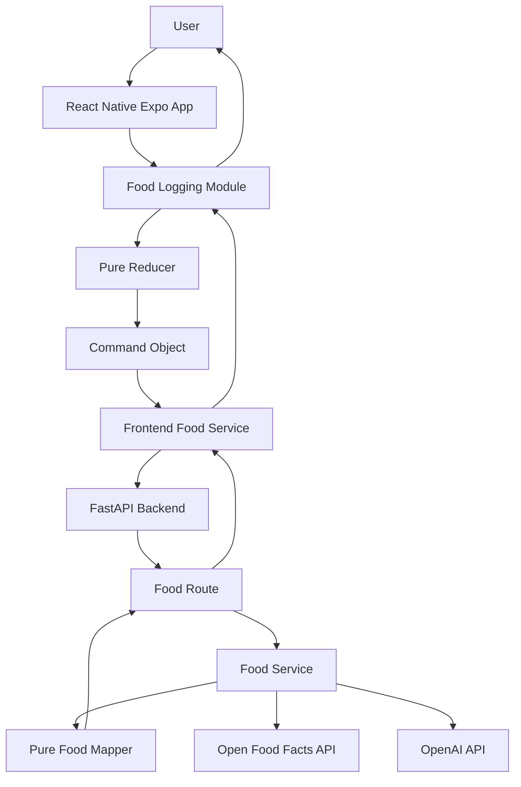

# Architecture

## Overview

The system follows a layered architecture separating frontend, backend, and external services.

The Food Logging module is implemented using the Command pattern to manage user actions and state transitions.

## Diagram

