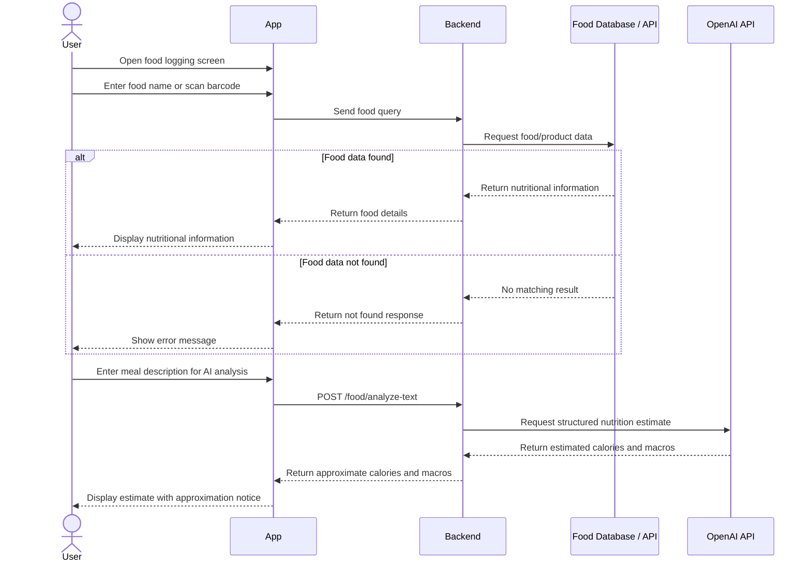

# Food Logging Flow

```mermaid
sequenceDiagram
    actor User
    participant App
    participant Backend
    participant FoodAPI as Food Database / API
    participant OpenAI as OpenAI API

    User->>App: Open food logging screen
    User->>App: Enter food name or scan barcode
    App->>Backend: Send food query
    Backend->>FoodAPI: Request food/product data

    alt Food data found
        FoodAPI-->>Backend: Return nutritional information
        Backend-->>App: Return food details
        App-->>User: Display nutritional information
    else Food data not found
        FoodAPI-->>Backend: No matching result
        Backend-->>App: Return not found response
        App-->>User: Show error message
    end

    User->>App: Enter meal description for AI analysis
    App->>Backend: POST /food/analyze-text
    Backend->>OpenAI: Request structured nutrition estimate
    OpenAI-->>Backend: Return estimated calories and macros
    Backend-->>App: Return approximate calories and macros
    App-->>User: Display estimate with approximation notice
```
